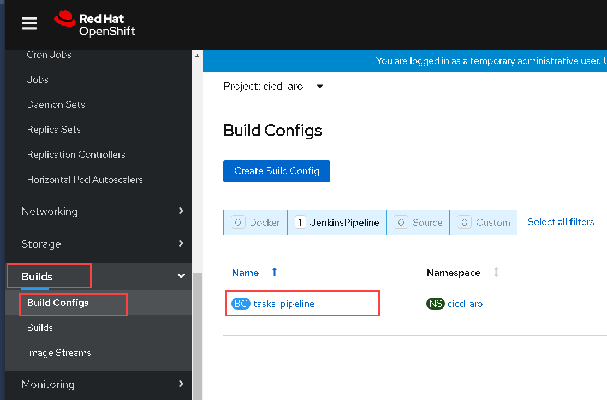
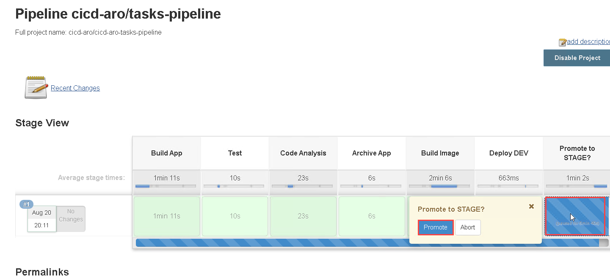

# LAB 3 : CI/CD 
## 3.1 CI/CD Demo Overview 

With Continuous Integration and Continuous Delivery, you can accelerate the development and deliver of your microservices. Azure Red Hat OpenShift provides seamless supports to open source DevOps & CICD tools, like Jenkins, Nexus, GitHub and SonarQube.

### The OpenShift CI/CD Demo

In this lab, you'll deploy a complete CI/CD demo on Azure Red Hat OpenShift. 

Following components will be deployed onto your Azure Red Hat OpenShift cluster.

- A sample Java application, the source code is available at https://github.com/OpenShiftDemos/openshift-tasks
- A sample OpenShift Pipeline, a pre-defined CI/CD pipeline on ARO.
- Jenkins, open source CI/CD engine and automation server.
- Nexus, software artifact repository.
- SonarQube, code quality platform.
- Gogs, a self-hosted Git service.
- PostgreSQL, open source RDBMS database.
- Eclipse Che, web based Eclipse IDE.

The following diagram shows the steps included in the deployment pipeline:


On every pipeline execution, the code goes through the following steps:

- Code is cloned from Gogs, built, tested and analyzed for bugs and bad patterns
- The WAR artifact is pushed to Nexus Repository manager
- A container image (tasks:latest) is built based on the Tasks application WAR artifact deployed on WildFly
- The Tasks app container image is pushed to the internal image registry
- The Tasks container image is deployed in a fresh new container in DEV project
- If tests successful, the pipeline is paused for the release manager to approve the release to STAGE
- If approved, the DEV image is tagged in the STAGE project
- The staged image is deployed in a fresh new container in the STAGE project

To learn more about this CI/CD demo, you can visit [this](https://github.com/nichochen/openshift-cd-demo) GitHub Repo.

## 3.2 Deploy CI/CD Demo

### Clone the GitHub Repo 

To deploy the CI/CD demo, you need to download the required deployment files from GitHub repository `https://github.com/siamaksade/openshift-cd-demo.git`.

On your Azure Cloud Shell, clone the OpenShift CI/CD demo repository. Currently ARO supports OpenShift 4.3, you'll need to checkout branch `ocp-4.3`.

```sh
git clone https://github.com/siamaksade/openshift-cd-demo -b ocp-4.3 cicd
```

### Deploy the demo 

Now you can proceed to deploy the demo by running the script file `provision.sh`, which is under the folder `scripts`. In the following command, we specified to install Eclipse Che, and setting the project name suffix as `aro`.

```sh
./cicd/scripts/provision.sh deploy --enable-che --ephemeral --project-suffix aro
```

### Verify the deployment

After the deployment is completed, you can verify the newly created resources.

Run the following command to review the list of projects.

```sh
oc get project
```

You'll see following projects are created by the demo provision script.
```sh
$ oc get project
NAME        DISPLAY NAME    STATUS
cicd-aro    CI/CD           Active
dev-aro     Tasks - Dev     Active
openshift                   Active
stage-aro   Tasks - Stage   Active

```

Confirm the status of all related containers is `Running` or `Completed`.

```sh
$ oc get pod -n cicd-aro
```

If the deployment finished successfully, you will see something similar to the following output.
```sh
NAME                        READY     STATUS      RESTARTS   AGE
che-2-l4q5k                 1/1       Running     0          2m
cicd-demo-installer-w46dp   0/1       Completed   0          1m
gogs-1-krr7x                1/1       Running     2          2m
gogs-postgresql-1-fftjn     1/1       Running     0          2m
jenkins-2-mqpwv             1/1       Running     0          3m
nexus-2-8wvwx               0/1       Running     0          2m
nexus-2-deploy              1/1       Running     0          2m
sonardb-1-4b6kg             1/1       Running     0          2m
sonarqube-1-844q7           1/1       Running     0          2m
```

From the Azure Red Hat OpenShift web console, you can see the newly created project and resources as well.

## 3.3 Run CI/CD Pipeline

A CI/CD pipeline is created by the demo provision script. Please review the pipeline and trigger an execution.

On OpenShift Web Console, Navigate to project `cicd-aro`. From the side navigation menu, select menu item `Builds`, then select`Build Configs`. 

You will see there is a pipeline, named `tasks-pipeline`. Click on the name of the pipeline, then you will see the pipeline overview page. In the tab `Configuration`, you will see the definition of the pipeline.



To run the pipeline, click on button `Actions`and select `Start Build` from the dropdown. Then Azure Red Hat OpenShift will start a new execution instance for that pipeline.


### Monitor the pipeline

After triggering a pipeline execution, please monitor the execution on the web console.

You will see the execution result of each stage of the pipeline.


For detail information, you can click on the link `View Log` of a execution instance to review the real time log output. After clicking `View Log`, you will be navigated to the Jenkins login page. Login with OpenShift credentials and grant all the required permissions to Jenkins, then you will see the log output in Jenkins.


### Approve pipeline task

You may define steps which required user intervention. You can either approve the request in Azure Red Hat OpenShift web console, or in Jenkins. Please allow the pipeline to promote the deployment from project `Dev` to `Stage`.

When the pipeline execution runs to stage 'Promote to STAGE?' You will see the pipeline is paused and asking for your input.

![Approve Pipeline Task]../media/cicd-approve.png)

Click on the link `Input Required` , and you will be navigated to Jenkins. Click `Back to Project` button and the click on the `Promote` buttion in Jenkins to resume the pipeline build.

<\br>




### Verify the results

After the pipeline execution is completed, please review the execution result on the web console. You also can login to the Jenkins console to check out the detail.

If everything works fine, you will be albe to see all pipeline stages completed successfully, as it shown below. The sample application was built and deployed into project `Dev` and `Stage`.


You can checkout the status of the application pods in project `Dev` and `Stage`. Following are the commands and sample output.
```sh
$ oc get pod -n dev-aro
NAME            READY     STATUS      RESTARTS   AGE
tasks-1-build   0/1       Completed   0          9m
tasks-3-59x64   1/1       Running     0          8m
```

```sh
$ oc get pod -n stage-aro
NAME            READY     STATUS    RESTARTS   AGE
tasks-4-v8fzt   1/1       Running   0          7m
```

You can also get the Route of your deployment in project `Dev` or `Stage`, then access the deployment with the URL, in a web browser.

```sh
$ oc get route -n dev-aro
NAME      HOST/PORT                                                  PATH      SERVICES   PORT      TERMINATION   WILDCARD
tasks     tasks-dev-aro.apps.xxxxxxxxxxxx.eastus.azmosa.io             tasks      8080                    None

```

## 3.4 Cloud Native IDE

To provide your development team a cloud native experience, you can leverge the power of a cloud native integrated development environment (IDE). Eclipse Che is an open-source web based IDE. It supports multi-users and wide range of programming languages and frameworks.

### Launch Eclipse Che

Please launch Eclipse Che and create a workspace for the demo application.

Get the Route for Eclipse Che with following command.

```sh
oc get route -n cicd-aro che
```

You will see some output similar as following.

```sh
NAME      HOST/PORT                                                 PATH      SERVICES   PORT      TERMINATION   WILDCARD
che       che-cicd-aro.apps.xxxxxx.eastus.azmosa.io             che-host   http                    None                                                                                                                                              
```
To access Eclipse Che web console, open the URL which is indicated by  `HOST/PORT` in a web browser.

On the Eclipse Che, select the `Blank` stack, and click button `CREATE & OPEN` to create a blank workspace.


It will take some time for Eclipse Che to setup the workspace. Wait until the workspace is ready, then you can proceed to the next task.

### Check Out Source Code

After the Eclipse Che workspace is ready, please check out the source code of the demo application on Eclipse Che.

Check out the Route URL of Gogs server. Gogs is a light-weight self-hosted Git service. 

```sh
$ oc get route -n cicd-aro gogs
```

Please login to Gogs as user `gogs` with password `gogs`. Copy the address of the repository `openshift-tasks`.


Back to Eclipse Che, click `Import Project` from menu `Workspace` to import the source code from the remote repository. Make sure select `GIT` as the version control system, paste the repository URL which you copied from Gogs into the filed `URL`. Check the Branch checkbox, and put `eap-7` in the textbox for branch. Click button `import`, in the next screen, select `Maven` for project configuration.


### Change and Deploy

Please make some changes to the demo application, and commit the changes to the remote Git repository.

Open file `src` > `main` > `webapp` > `index.jsp`. Change line 7 and line 45 from `OpenShift Tasks Demo` to `Azure Red Hat OpenShift Tasks Demo`. Then save the changes.

Before you can commit your changes to Git, you need to setup your Git profile. From top menu `Profile`, select menu item `Preferences`. In the `Preferences` dialog, click `Committer` which is under the section `Git`. Put in user name `gogs` and email `admin@gogs.com`. Click button `save`, then button `close`, to save the changes and close the dialog.


Next, you need to commit the changes. Click menu item `Commit` from menu `Git` which is at the top. Put 'Update title' in the comment text area. Click button `commit` to commit the changes.

In the `Terminal` window, which is down at the button in the Eclipse Che window, run following commands to push the changes to remote Gogs Git repository. You will be asked to enter the user name and password for the repository, which are both `gogs`.

```sh
$ cd openshift-tasks/
$ git push origin
```

### Verify the update

After pushing the commit to the remote repository, the CI/CD pipeline will be triggered automatically. You will see a new pipeline execution has been launched for the new commit. After the execution finished successfully, you will be able to see your changes on the web page of the application.

From this example you can see, it's easy to build up a CI/CD pipeline with Open Source tool chains and Azure Red Hat OpenShift. With container & cloud based CI/CD, application development and delivery are significantly accelerated.

